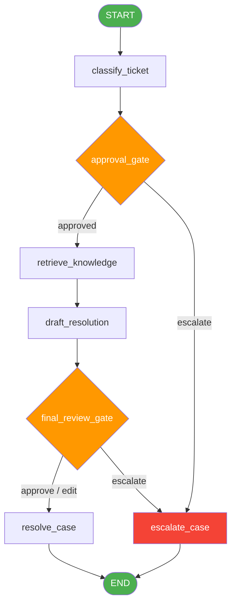

# 🤖 LangGraph Customer Support Agent

A production-style **AI customer support agent** built with [LangGraph](https://github.com/langchain-ai/langgraph), featuring structured ticket classification, knowledge-base retrieval, and **human-in-the-loop** approval gates — all backed by SQLite persistence.

---

## ✨ Features

| Feature | Description |
|---|---|
| **Ticket Classification** | LLM classifies tickets by category, intent, priority & sentiment using Pydantic structured output |
| **Knowledge Retrieval** | Keyword-based retrieval over an in-memory knowledge base (6 articles) |
| **Human-in-the-Loop** | Two interrupt gates — classification approval and final response review |
| **Persistence** | SQLite-backed checkpointing so sessions survive restarts |
| **Escalation** | Automatic or human-triggered escalation to specialist agents |
| **Interactive CLI** | Run the agent from the terminal with live human review prompts |

---

## 🏗️ Architecture



**Key flow:**
1. **Classify** the incoming ticket (category, intent, priority, sentiment)
2. **Approval gate** — high-risk tickets pause for human review
3. **Retrieve** relevant knowledge-base articles
4. **Draft** a response using the LLM
5. **Final review gate** — sensitive responses pause for human approval/edit
6. **Resolve** or **escalate** the case

---

## 📋 Prerequisites

- **Python 3.10+**
- **OpenAI API key** ([get one here](https://platform.openai.com/api-keys))

---

## 🚀 Getting Started

### 1. Clone the repository

```bash
git clone https://github.com/niti007/langgraph-customer-support-agent.git
cd langgraph-customer-support-agent
```

### 2. Create a virtual environment

```bash
python -m venv venv
# Windows
venv\Scripts\activate
# macOS/Linux
source venv/bin/activate
```

### 3. Install dependencies

```bash
pip install -r requirements.txt
```

### 4. Set up your API key

```bash
cp .env.example .env
# Edit .env and add your OpenAI API key
```

### 5. Run the agent

```bash
python main.py
```

---

## 💬 Usage Example

```
╔══════════════════════════════════════════════════════════╗
║    LangGraph Customer Support Agent — Interactive CLI   ║
╚══════════════════════════════════════════════════════════╝

  Customer ID: CUST_1001
  Customer message: I was charged twice for my subscription and I want a refund.

──────────────────────────────────────────────────────────
  PROCESSING TICKET
──────────────────────────────────────────────────────────

──────────────────────────────────────────────────────────
  🔔 HUMAN REVIEW REQUIRED
──────────────────────────────────────────────────────────
  stage: classification_review
  category: billing
  intent: refund_request
  priority: high
  sentiment: frustrated

  Your decision (JSON or plain text): {"decision": "approved", "notes": "Proceed"}

──────────────────────────────────────────────────────────
  ✅ FINAL RESULT
──────────────────────────────────────────────────────────
  Status: resolved
  Response:
  We apologize for the duplicate charge. Since your refund request is within
  the 7-day window, we can process it right away...
```

---

## 📁 Project Structure

```
langgraph-customer-support-agent/
├── main.py                 # Interactive CLI entry point
├── requirements.txt        # Python dependencies
├── .env.example            # API key template
├── LICENSE                 # MIT License
├── notebook/               # Original Jupyter notebook
│   └── Lab_2_...ipynb
└── src/
    ├── __init__.py
    ├── config.py            # LLM & environment setup
    ├── models.py            # Pydantic structured output schemas
    ├── state.py             # LangGraph state definition
    ├── knowledge_base.py    # Knowledge articles & retriever
    ├── llm_helpers.py       # LLM classification & resolution
    ├── nodes.py             # All graph node functions
    └── graph.py             # Graph assembly & compilation
```

---

## 📓 Original Notebook

The original Jupyter notebook is preserved in [`notebook/`](notebook/) for reference. It contains the same logic in a step-by-step tutorial format designed for Google Colab.

---

## 🛠️ Tech Stack

- [LangGraph](https://github.com/langchain-ai/langgraph) — stateful agent orchestration
- [LangChain](https://github.com/langchain-ai/langchain) — LLM abstraction layer
- [OpenAI GPT-4o-mini](https://platform.openai.com/) — language model
- [Pydantic](https://docs.pydantic.dev/) — structured output validation
- [SQLite](https://www.sqlite.org/) — checkpoint persistence

---

## 📄 License

This project is licensed under the [MIT License](LICENSE).
